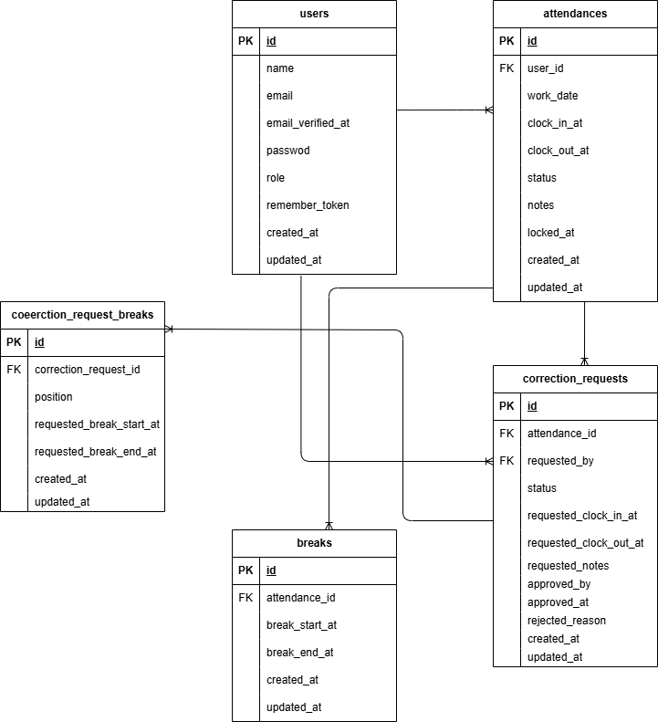

# coachtech勤怠管理アプリ

## 概要
- 出勤・退勤・休憩を記録し、月次一覧/詳細、修正申請（承認フロー）を行うアプリ。

## 使用技術
- PHP 8.3 / Laravel 12.x
- MySQL 8.0
- Nginx + PHP-FPM
- Docker / Docker Compose

## リポジトリ構成
- ルート: Docker 一式（docker-compose.yml, docker/）
- アプリ本体: src/（コンテナ内 /var/www/html/src）

## 環境構築
1) 取得と起動
```bash
git clone git@github.com:sakaisan1125/coachtech-attendance-app.git
cd coachtech-attendance-app
docker compose up -d --build
```
2) Laravel 初期化（PHP コンテナ名: php）
```bash
docker compose exec php bash -lc '
  cd /var/www/html/src &&
  composer install &&
  [ -f .env ] || cp .env.example .env &&
  php artisan key:generate &&
  php artisan migrate --seed &&
  php artisan storage:link
'
```
3) アクセス
- http://localhost

## ログインURL
- 一般: http://localhost/login
- 管理: http://localhost/admin/login

## 主な画面/ルート
- /attendance（打刻）
- /attendance/list?month=YYYY-MM（一覧）
- /attendance/detail/{id}（詳細）
- /attendance/detail/date/{YYYY-MM-DD}（勤務なし日の詳細作成/表示）
- 管理: /admin 配下

## 機能
- 打刻（出勤/退勤・休憩複数行）
- 月次一覧（前月/翌月移動、合計表示、詳細リンク）
- 詳細/修正申請（申請中は申請内容をロック表示）
- 管理者承認

## ポート（例）
- アプリ: http://localhost
- MySQL: 3306
- phpMyAdmin: 8080
- MailHog: 8025

## シード/テストユーザー
- 一般ユーザー: user1@example.com / password123
- 管理ユーザー: admin@example.com / password123

## ER 図

